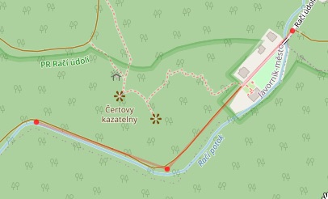
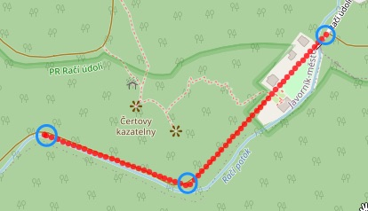

# geonetpy

Tools and algorithms for building geographical networks. 


## interpolaton

Load gpx track and render it to html:
```bash
./main.py track open examples/raci_udoli.gpx interpolate html
```


Load same gpx track, interpolate points (default max distance is 10m) and render it to html:

```bash
./main.py track open examples/raci_udoli.gpx html
```


## match submodule

Computes the overlapping segments/clusters of two GPS tracks. It uses KDTree
and clusterization algorithm 

## notes

### gps coordinates


* latitude - angle between the equatorial plane and the straight line that
  passes through that point and through (or close to) the center of the Earth
  Latitude goes for 0 at the equator to +90 N at the North Pole or -90 S at
  the South Pole where the angle is also measured from the center of the earth

* longitude - angle east or west of a reference meridian to another meridian
  that passes through that point. Longitude ranges from 0 to 180 E
  and 0 to 180 W

Example:
```
                    lat           lng
cleaveland ohio: 41.4996572N, 81.6936772W
```
